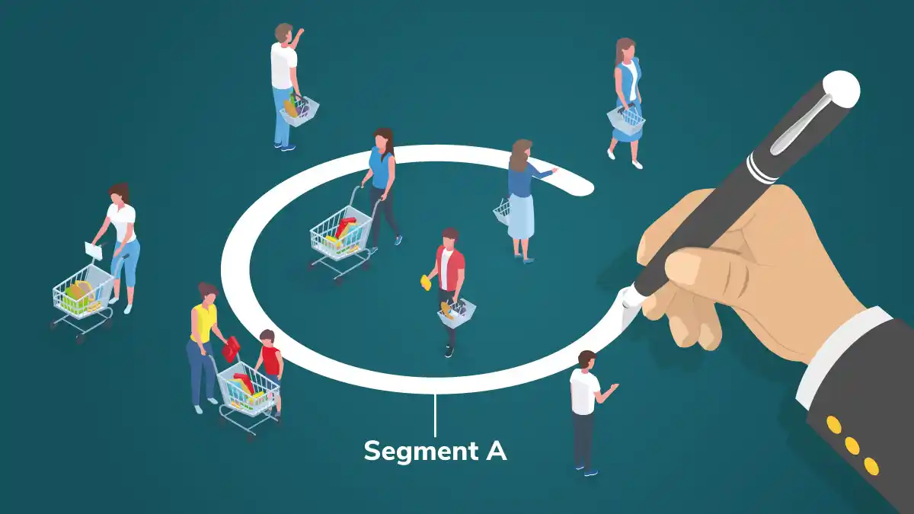

<h1 align="center">Hi, I'm Erika 👋</h1>
<h3 align="center">A student data scientist, researcher, data analyst </h3>

- 🌱 I’m currently studying **Master's in Data Science**.
- 😄 I studied **Bachelor's in Science: Economics**.
- 🔭 I’m currently working on **individual and group data projects**. 

- 👨‍💻 Some of my projects are pinned below, and listed in my main [Personal Portfolio](https://github.com/erica-prog/portfolio/tree/main).
- 👨‍💻 Click here to view my [Website](https://erica-prog-website.com/).

----
## Projects

Few projects I have worked on:

 **[Capital One Fictional Company Credit Card Customer Churn](https://github.com/erica-prog/capital_one_credit_risk_customer_churn)**

This project develops a sophisticated machine learning framework using AdaBoost and advanced feature engineering to predict credit card customer churn with 78.61% accuracy, achieving an exceptional 89.2% ROI through targeted retention campaigns. The solution combines SMOTEENN sampling for class imbalance, comprehensive behavioral analysis, and an interactive Streamlit dashboard to provide real-time risk assessment and actionable insights that prevent customer attrition and generate $384,750 in annual net business benefit.

  

 **[Scrollytelling with Quarto: Close Read Prize Contest](https://github.com/erica-prog/erica-prog.github.io)**

This project analyzes the financial risk of semiconductor stocks using O-GARCH and Value-at-Risk (VaR) models in R to assess stock volatility and investment risks. The findings are presented on a personal website built with the R library ‘qmd-lab/closeread’, HTML and CSS. Examining stock volatility and investment risks highlights key factors influencing market fluctuations and helps investors make informed decisions. 

  

 **[Assessing Bias in Mortgage Lending Using Supervised Machine Learning Methods](https://github.com/erica-prog/mortgage-lending-using-supervised-ml-methods)**

I applied Python-supervised machine learning algorithms to assess bias in mortgage lending decisions. The project predicts loan approval outcomes based on applicant data, mitigating bias and improving decision-making processes in mortgage lending through data-driven insights.

  

 **[SmartRetail: Customer Segmentation for Micro-Targeting](https://github.com/erica-prog/customer-segmentation-for-micro-targeting)**

I implemented customer segmentation techniques to enhance marketing strategies using R. By analyzing consumer data, the project can identify distinct customer groups, enabling more targeted and effective marketing campaigns tailored to specific audience segments.

  

 **[Airbnb Housing Factors Influencing Prices Project](https://github.com/erica-prog/Airbnb-factors-prices-project)**

The objective of this Python project is to analyze various factors affecting Airbnb pricing. By examining data on property features, locations, and host attributes, the study identifies key determinants that influence rental prices, providing insights for hosts to optimize their listings.

  

----

<h3 align="left">Connect with me:</h3>

<h3 align="left">Languages and Tools:</h3>

    

